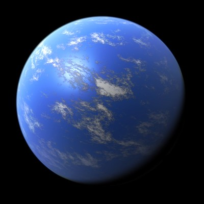

# SEAWRD
**S**urrogate **E**mulator for **A**quatic **W**orld **R**adius **D**etermination - "sea-ward"

Surrogate model creator for predicting the radius of irradiated ocean worlds. For installation instructions, tutorials, and detailed documentation, start [here](http://seawrd.readthedocs.io).

## Motivation

Planetary interior modelling for ocean worlds is a computationally demanding exercise, involving a lot of hydrodynamical considerations dependent on the composition and physical properties of a given exoplanet. This can take a number of minutes per-planet, which grows to be incredibly large when performing hundreds of thousands of simulations.

A cheap approximation is available in the form of surrogate models. A neural network can act as a general function learner, i.e., something that maps inputs to outputs, and so we can use pre-ran expensive simulation data to train a small neural network to reproduce the simulation's results with great accuracy in a fraction of the time.

This is what **S**urrogate **E**mulator for **A**quatic **W**orld **R**adius **D**etermination is for! Based on user-provided hyperparameters and data, it can train an appropriate surrogate model to be used as an approximation for the full hydrodynamical simulations, namely as a predictor of the radius of the planet.

## Contributors

SEAWRD is written in Python and was pursued as a part of Code/Astro Workshop 2026 by Group 13. The authors of this package are:

|Ashley Parr|Bishwash Devkota|Fredi Quisipe|Ian Rain-Water|
|-----|----|----|-----|

## Attribution

Please cite the DOI if you make use of this software in your research. 

## Acknowledgements

The authors of this project would like to thank [Artyom Aguichine](https://an0wen.github.io/) for providing the motivation and skeleton code adapted for this Code/Astro project.

The data source file "DNN_data_IOP_Aguichine2021.dat" used in the example usage Jupyter notebook is from Aguichine et al. (2021), and you are encouraged to read their paper found here:

A. Aguichine, O. Mousis, M. Deleuil, and E. Marcq, “Mass–Radius relationships for irradiated ocean planets,” The Astrophysical Journal, vol. 914, no. 2, p. 84, Jun. 2021, doi: [10.3847/1538-4357/abfa99](https://doi.org/10.3847/1538-4357/abfa99).
